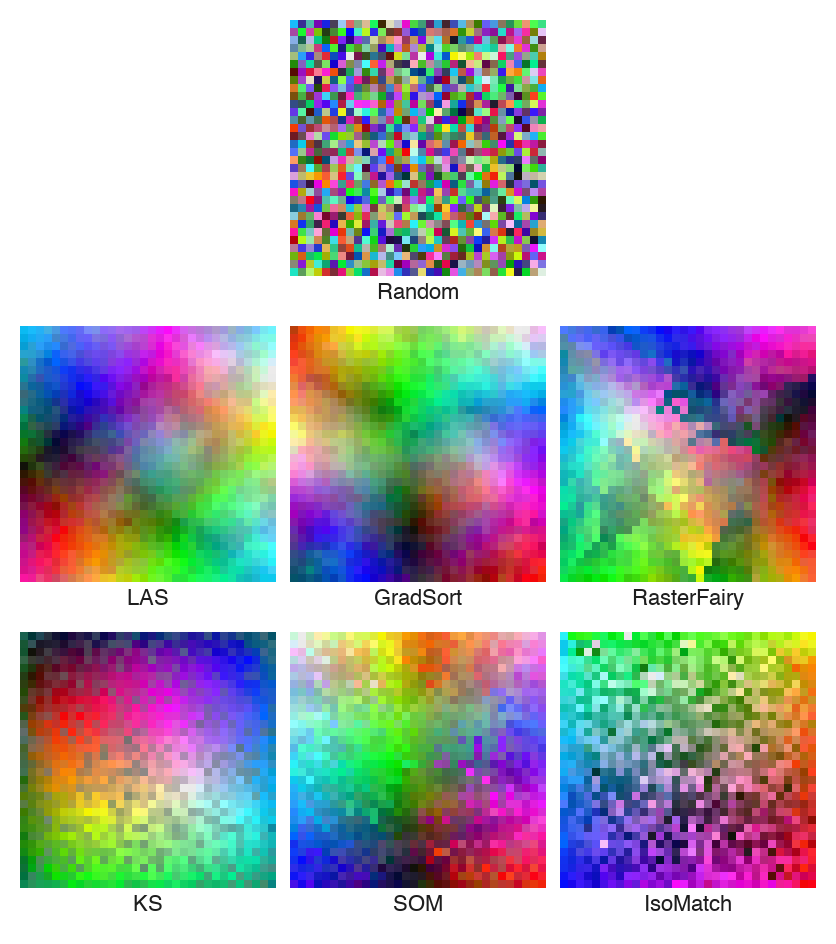

# 2D Grid-Sorting Benchmark

This project benchmarks several algorithms that arrange a set of high-dimensional elements onto a 2-D grid such that similar elements end up near each other. The canonical demo uses a **32 × 32 random RGB image** where every pixel is a separate element (1 024 elements in total).

## Results

### Visual Comparison



### Benchmark Table (32 × 32 RGB, 1024 elements)

| Algorithm   | Time (s) | DPQ (p=16) |
|-------------|:--------:|:----------:|
| LAS         |     6.04 |     0.9555 |
| GradSort    |   465.91 |     0.9436 |
| RasterFairy |    64.73 |     0.9086 |
| KS          |    17.25 |     0.8978 |
| SOM         |     4.48 |     0.8906 |
| IsoMatch    |  1025.75 |     0.7684 |
| Random      |     0.08 |     0.3294 |

Run the benchmark yourself with:

```bash
python benchmark.py
```

---

## Usage

```bash
python gridsort.py --method [LAS|Gradsort|RF|SOM|Random|KS]
```

Each run saves a sorted PNG and prints the **Distance Preservation Quality (DPQ)**.

---

## Algorithms

### LAS — Locally-Adaptive Sorting
**Implementation:** `rgb_las.py` → `sort_with_las()`

LAS iteratively refines a 2-D arrangement using progressively finer local structure:

1. Randomly place all elements on the grid.
2. Apply a uniform low-pass (box) filter to the current grid to obtain *prototype* vectors.
3. Solve a linear assignment problem (Hungarian algorithm) between input elements and prototype vectors.
4. Rearrange the grid according to the optimal assignment.
5. Shrink the filter radius by `radius_factor` and repeat until the radius falls below 1.

FLAS (Fast LAS) extends this by only solving approximate local assignment problems instead of the global one, giving a significant speed-up for large grids.

**Reference:** Visual Computing Group, HPI  
https://github.com/Visual-Computing/LAS_FLAS

---

### GradSort
**Implementation:** `gridsort.py` → `gradsort_rgb()`

GradSort formulates grid sorting as a **differentiable optimisation problem**. A transformer network predicts an N × N assignment matrix which is relaxed to a doubly-stochastic matrix via the **Gumbel-Sinkhorn** operator. The network is trained end-to-end by minimising two complementary losses:

- **Neighbourhood loss** L_nbr: penalises large feature distances between horizontal and vertical grid neighbours.
- **Distance-matrix loss** L_p: encourages the sorted distance matrix to match the original (doubly-sorted) distance matrix.
- **Constraint loss** L_s: keeps the soft permutation close to a true permutation matrix.

At inference the hard permutation is extracted from the trained network, then refined by a final linear sum assignment step.

**Reference:** Visual Computing Group, HPI  
https://github.com/Visual-Computing/GradSort

---

### RasterFairy
**Implementation:** `gridsort.py` → `raster_fairy_rgb()`

RasterFairy is a two-stage method:

1. **t-SNE projection** — embed the high-dimensional elements into 2-D using pairwise distances as input to t-SNE.
2. **Grid assignment** — use RasterFairy's point-cloud-to-grid transformer (`transformPointCloud2D`) to snap the continuous 2-D positions to integer grid cells.
3. **Swap optimisation** — refine the assignment with a stochastic swap optimiser that minimises total displacement in the 2-D embedding.

**Reference:** Mario Klingemann (Quasimondo)  
https://github.com/Quasimondo/RasterFairy

---

### SOM — Self-Organising Maps
**Implementation:** `gridsort.py` → `self_organizing_maps_rgb()`

A **MiniSom** network is trained on the raw RGB feature vectors. After training:

1. Each element is mapped to its **best-matching unit (BMU)** on the SOM grid.
2. Grid cells that receive more than one element (*collisions*) are resolved by applying the **Hungarian algorithm** to reassign surplus elements to the nearest empty cells.

The competitive learning dynamics of the SOM ensure that topologically close neurons respond to similar inputs, producing a smooth arrangement.

**Reference:** Justin Gloudemans — MiniSom  
https://github.com/JustGlowing/minisom

---

### KS — Kernelized Sorting
**Implementation:** `gridsort.py` → `KS_rgb()`

Kernelized Sorting finds the permutation matrix **Π** that maximises the alignment between a **kernel on the feature space** and a **kernel on the target grid**. The objective is:

```
max_Π  tr(K_X  Π  K_G  Πᵀ)
```

where K_X is the feature kernel, K_G is the grid kernel, and the maximisation is over doubly-stochastic matrices (relaxation of permutation matrices). The solution is found via eigendecomposition followed by a greedy assignment.

**Reference:** Novi Quadrianto, Le Song, Alex Smola (2009)  
*Kernelized Sorting* — NeurIPS 2009  
https://users.sussex.ac.uk/~nq28/pubs/QuaSonSmo09.pdf

---

### IsoMatch
**Implementation:** `gradsort.py` → `isomatch_rgb()`

IsoMatch uses **Isomap** (a manifold learning technique) to embed the high-dimensional elements into a low-dimensional space that respects geodesic distances, then solves a **bipartite matching** problem to assign elements to grid positions. An optional random-swap refinement phase further improves the result.

**Reference:** Fried, Shechtman, Goldman, Finkelstein (2015)  
*IsoMatch: Creating Informative Grid Layouts*  
https://github.com/ohadf/isomatch

---

### Random (baseline)
**Implementation:** `gridsort.py` → `random_rgb()`

Elements are placed on the grid in a random order. This baseline provides a lower bound for grid quality scores and DPQ values.

---

## Evaluation Metric — Distance Preservation Quality (DPQ)

DPQ measures how well the 2-D spatial neighbourhood structure reflects the high-dimensional distance structure of the data.

For each element, the function computes the average high-dimensional distance to its *k* nearest grid neighbours for every k from 1 to N-1, then compares this curve to the ideal curve obtained by sorting by HD distance directly. The final score is the ratio of the ℓ_p norms of these two curves.

- **DPQ = 1.0** — perfect preservation of high-dimensional distances.  

Implemented in `rgb_las.py` → `distance_preservation_quality()`.

---

## Environment Setup

This project uses [uv](https://github.com/astral-sh/uv) for fast, reproducible dependency management.

### Install uv

```bash
curl -Lsf https://astral.sh/uv/install.sh | sh
```

### Create and activate the environment

```bash
uv venv
source .venv/bin/activate   # Linux / macOS
.venv\Scripts\activate      # Windows
```

### Install dependencies

```bash
uv sync
```

> **Note:** `KernelizedSorting_master` and its
> `kernelized_sorting_color.py` module must be placed in the project root
> (or on the Python path) manually, as it is not available on PyPI.

---

## Repository Layout

```
.
├── gridsort.py                          # Per-algorithm entry point
├── benchmark.py                         # Full comparison runner
├── rgb_las.py                           # LAS / DPQ implementation
├── KernelizedSorting_master/
│   └── kernelized_sorting_color.py      # KS implementation
├── results/                             # Output PNGs from benchmark.py
└── README.md
```